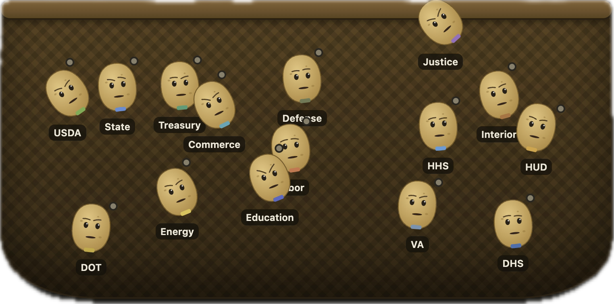
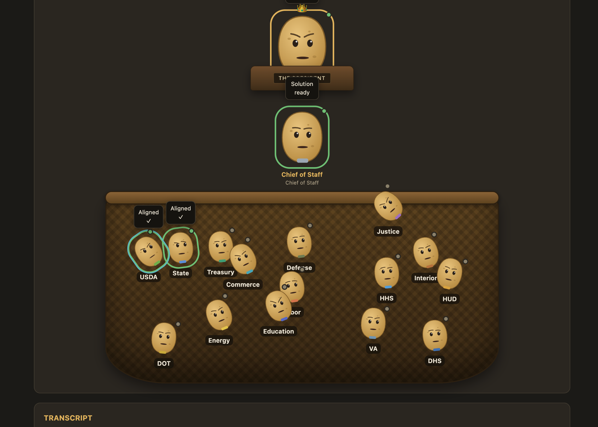
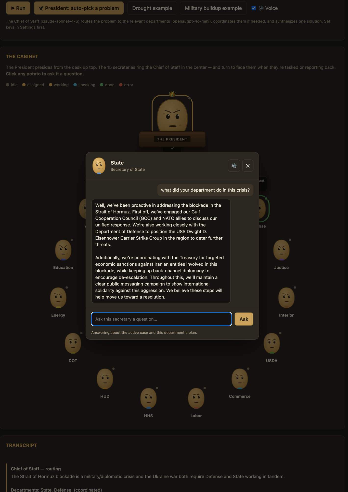
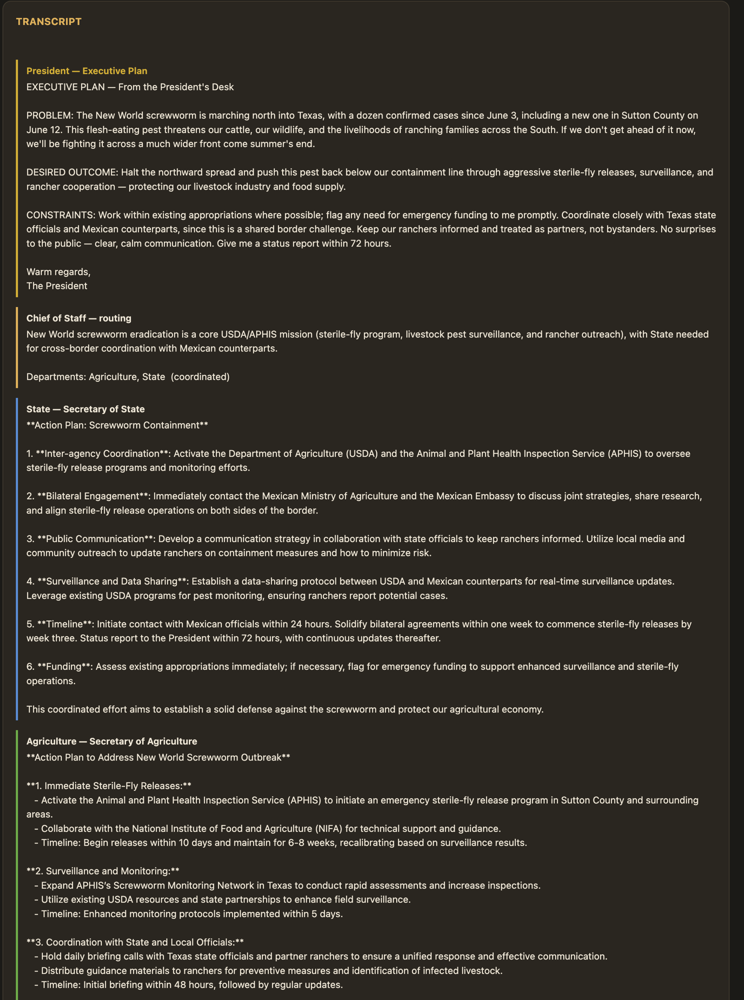
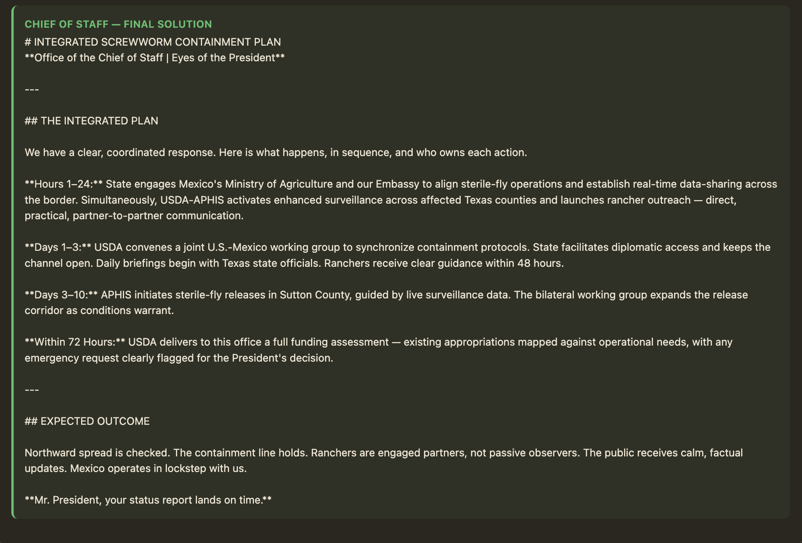

# 🥔 Potato Cabinet

 

## Single file only (runs in your browser)

 

**▶ Live demo: <https://jsherman999.github.io/potato_cabinet/>** (bring your own API keys)

Describe a real-world problem — or let the President pick one from the news — and watch an
LLM "Chief of Staff" route it to the relevant federal departments, coordinate them, and
synthesize a single solution. Each of the 15 cabinet secretaries is its own LLM agent,
rendered as a talking potato. The entire app is one self-contained
`index.html` (no build step, no server, no dependencies); you supply your own API keys.

## Screenshots

**The cabinet, in a basket** — the 15 department secretaries, jumbled together but labeled.

**A coordinated run** — the President hands off, the Chief of Staff routes, and the tasked
departments (here USDA + State) work, align, and report back.

**Ask any secretary** — click a potato to interrogate it; it answers in-context about the
active case and its own plan, and speaks the answer aloud.

**The President picks a problem from the news** — Opus 4.8 reviews a live news snapshot,
writes an Executive Plan (here, the New World screwworm outbreak), and the Chief of Staff
routes it to the right departments.

**One integrated solution** — the Chief of Staff synthesizes the department plans into a
single coordinated response.

## How it works

- **Chief of Staff (orchestrator)** decomposes the problem into JSON assignments, dispatches
  to the relevant secretaries in parallel, runs an optional coordination round, and
  synthesizes the final solution.
- **15 cabinet secretaries** — each an LLM agent grounded in its department's remit.
- **President (optional)** — reviews current news, picks a solvable problem, writes an
  Executive Plan, and hands it to the Chief of Staff.
- **Voice** — each potato speaks (OpenAI neural TTS — a Southern male drawl with a per-seat
  pitch spread); mouths animate while talking.
- **Q&A** — click any potato to ask it questions about the active case or its department.
- **Attachments** — paste links (fetched + summarized) or attach images (vision-analyzed)
  to enrich the case file before routing.

## Run it

You only need the one file:

1. Download **`index.html`** (~60 KB — the whole app; no other files required) or use the
   [live demo](https://jsherman999.github.io/potato_cabinet/).
2. Open it in a browser (double-click / `file://` — no server needed).
3. Open **Settings**, paste your API keys (OpenAI, OpenRouter, Anthropic), and **Test all providers**.
4. Type a problem (or pick an example / hit **🦅 President: auto-pick a problem**) and **Run**.

### Are my API keys safe?

Yes. There is **no backend** — the app is a single static HTML file, so there's nowhere for
your keys to be sent except the model providers themselves. Your keys are stored only in
**your own browser** (`localStorage`) and are transmitted over HTTPS **directly** to
OpenAI / OpenRouter / Anthropic — the only network requests the app makes. Nothing goes to
any server of mine (there isn't one). You can read the entire ~60 KB `index.html` to verify
this yourself, and the **Forget keys** button wipes them from your browser at any time.

## Models (configurable in the `CONFIG` block near the top of `index.html`)

| Role | Default |
|---|---|
| Orchestrator (Chief of Staff) | `claude-sonnet-4-6` (Anthropic) |
| Secretaries | `openai/gpt-4o-mini` (OpenRouter) |
| President | `claude-opus-4-8` (Anthropic) |
| Web research / link fetching | `google/gemini-2.5-flash:online` (OpenRouter) |
| Image analysis | `google/gemini-2.5-flash` (OpenRouter) |
| Voice | `gpt-4o-mini-tts` (OpenAI) |

See **[PLAN.md](PLAN.md)** for the full design, model research, and build notes.

---
*Built with Claude Code. It's potatoes all the way down.*
