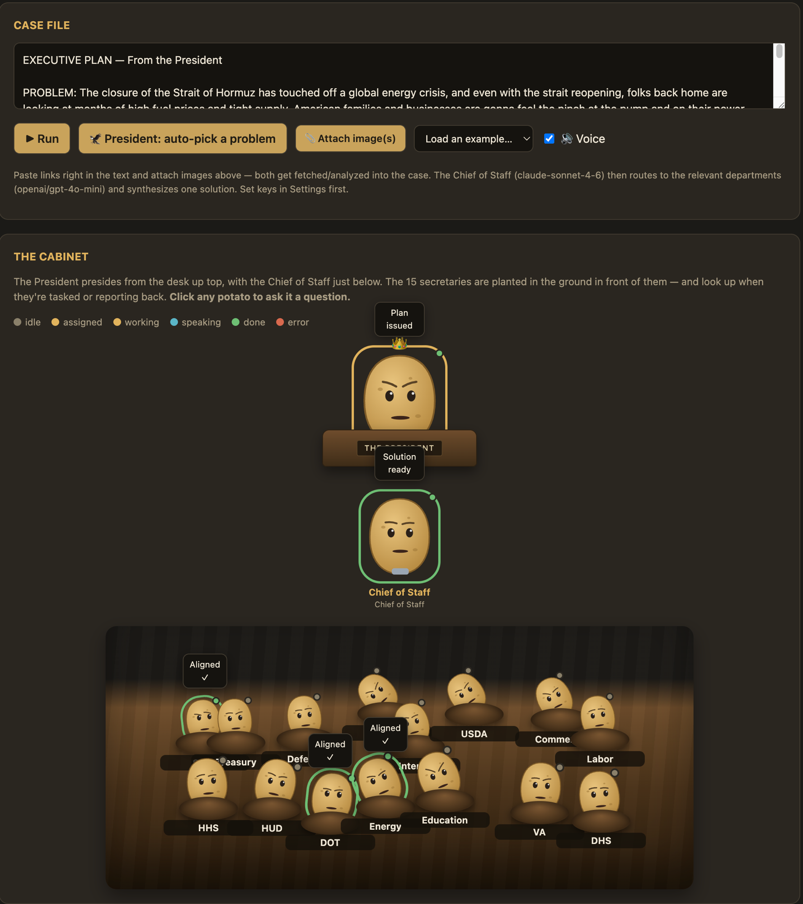
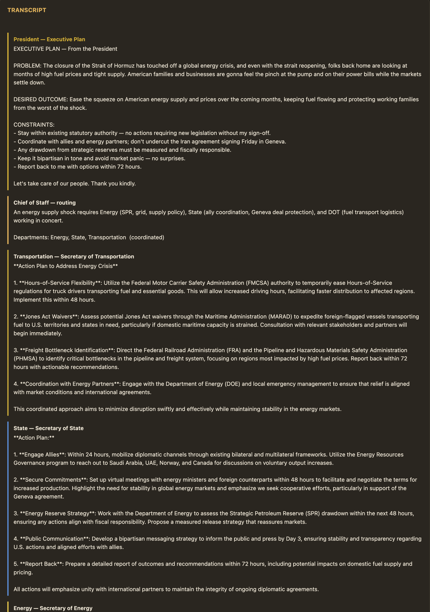
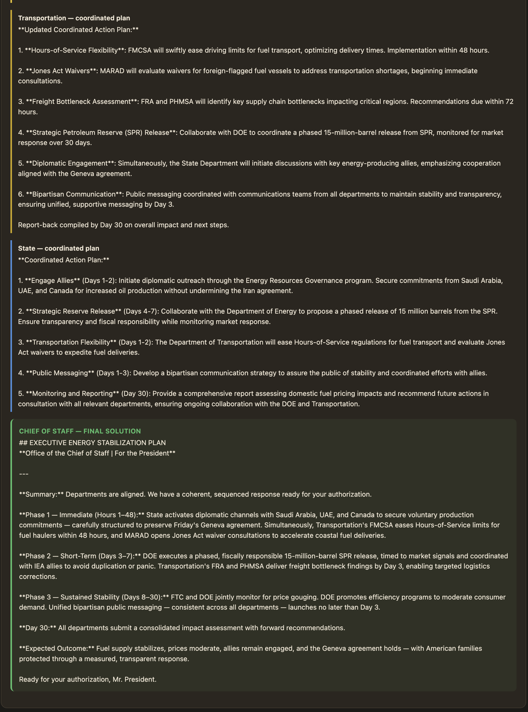
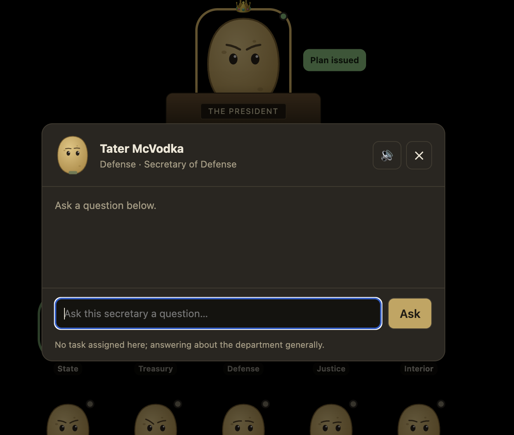
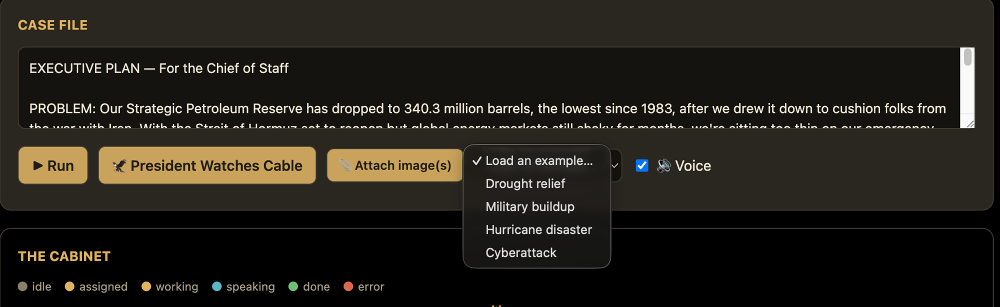

# 🥔 Potato Cabinet

 

## Single file only (runs in your browser)

 

**▶ Live demo: <https://jsherman999.github.io/potato_cabinet/>** (bring your own API keys)

Describe a real-world problem — or let the President pick one from the news — and watch an
LLM "Chief of Staff" route it to the relevant federal departments, coordinate them, and
synthesize a single solution. Each of the 15 cabinet secretaries is its own LLM agent,
rendered as a talking potato. The entire app is one self-contained
`index.html` (no build step, no server, no dependencies); you supply your own API keys.

## Screenshots

## How it works

- **Chief of Staff (orchestrator)** decomposes the problem into JSON assignments, dispatches
  to the relevant secretaries in parallel, runs an optional coordination round, and
  synthesizes the final solution.
- **15 cabinet secretaries** — each an LLM agent grounded in its department's remit.
- **President (optional)** — reviews current news, picks a solvable problem, writes an
  Executive Plan, and hands it to the Chief of Staff.
- **Voice** — each potato speaks (OpenAI neural TTS); mouths animate while talking.
- **Q&A** — click any potato to ask it questions about the active case or its department.
- **Attachments** — paste links (fetched + summarized) or attach images (vision-analyzed)
  to enrich the case file before routing.

## Run it

You only need the one file:

1. Download **`index.html`** (~60 KB — the whole app; no other files required) or use the
   [live demo](https://jsherman999.github.io/potato_cabinet/).
2. Open it in a browser (double-click / `file://` — no server needed).
3. Open **Settings**, paste **at least one** API key (see [Getting API keys](#getting-api-keys)), and **Test all providers**.
4. Type a problem (or pick an example / hit **🦅 President Watches Cable**) and **Run**.

### Getting API keys

You only need **one** key — the Cabinet routes every role to whichever provider(s) you set
(a single key drives the whole app). Each Settings field has a **get a key ↗** link too.

| Provider | Get a key | What it gives you |
|---|---|---|
| **OpenRouter** *(easiest start)* | <https://openrouter.ai/keys> | One key reaches OpenAI, Google, Anthropic & Meta models, and powers **live web research** (`:online`). Sign up, add a few dollars of credit, create a key (`sk-or-v1-…`). |
| **OpenAI** | <https://platform.openai.com/api-keys> | OpenAI models **plus the neural voices** (TTS). Sign in, add billing, create a secret key (`sk-…`). |
| **Anthropic** | <https://console.anthropic.com/settings/keys> | Runs **Claude** (Opus / Sonnet / Haiku) directly. Sign in, add billing, create a key (`sk-ant-…`). |

> **Single-key fallback:** with one key, every role uses that provider. Two notes — voices need
> the OpenAI key (otherwise the app falls back to your browser's built-in speech), and the
> President's *auto-pick from the news* + link-reading work best with an **OpenRouter** key, since
> that's the one with live web search; on an OpenAI- or Anthropic-only setup those answer from the
> model's training knowledge instead.

### Are my API keys safe?

Yes. There is **no backend** — the app is a single static HTML file, so there's nowhere for
your keys to be sent except the model providers themselves. Your keys are stored only in
**your own browser** (`localStorage`) and are transmitted over HTTPS **directly** to
OpenAI / OpenRouter / Anthropic — the only network requests the app makes. Nothing goes to
any server of mine (there isn't one). You can read the entire ~60 KB `index.html` to verify
this yourself, and the **Forget keys** button wipes them from your browser at any time.

## Models (configurable in the `CONFIG.roles` block near the top of `index.html`)

Each role lists provider candidates in preference order; the app uses the first one whose key
is set. With all three keys you get the per-role defaults (the first column); with a single key,
every role falls back to that provider's model.

| Role | Anthropic | OpenRouter | OpenAI |
|---|---|---|---|
| Orchestrator (Chief of Staff) | **`claude-sonnet-4-6`** | `openai/gpt-4.1-mini` | `gpt-4.1-mini` |
| Secretaries | `claude-haiku-4-5` | **`openai/gpt-4o-mini`** | `gpt-4o-mini` |
| President | **`claude-opus-4-8`** | `openai/gpt-4.1-mini` | `gpt-4.1-mini` |
| Web research / links | `claude-sonnet-4-6` | **`google/gemini-2.5-flash:online`** | `gpt-4.1-mini` |
| Image analysis | `claude-haiku-4-5` | **`google/gemini-2.5-flash`** | `gpt-4o-mini` |

Voice (TTS) uses OpenAI `gpt-4o-mini-tts` when an OpenAI key is set, otherwise the browser's
built-in speech. **Bold** = the default used when every key is present.

See **[PLAN.md](PLAN.md)** for the full design, model research, and build notes.

---
*Built with Claude Code. It's potatoes all the way down.*
