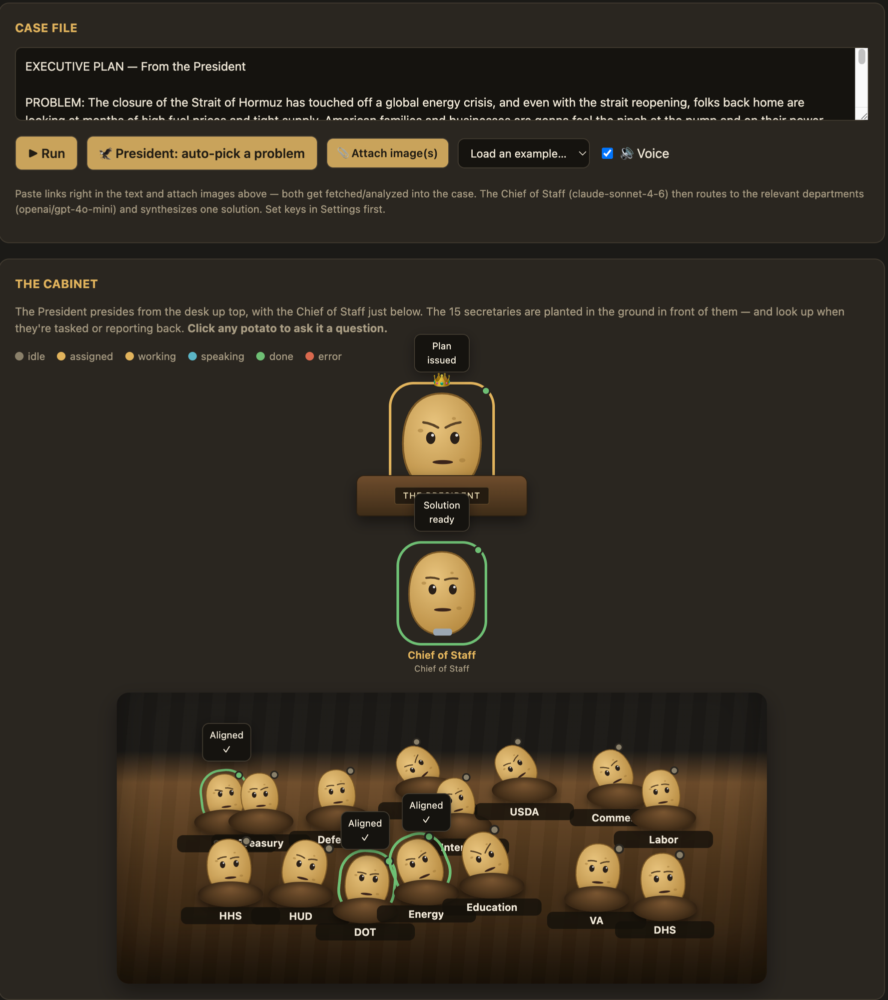
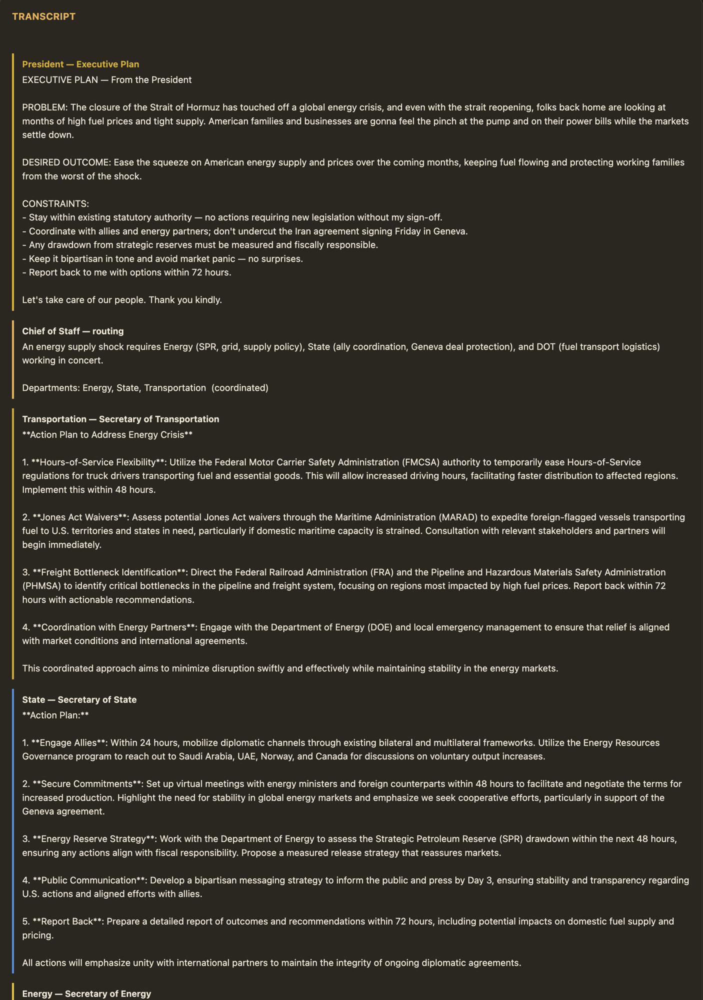
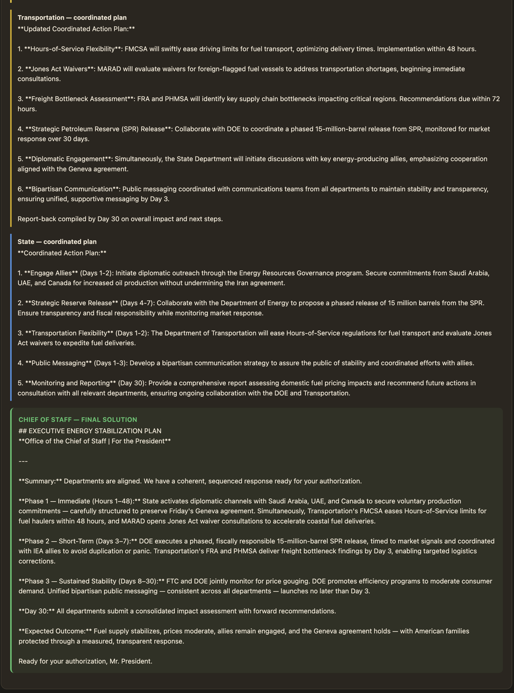
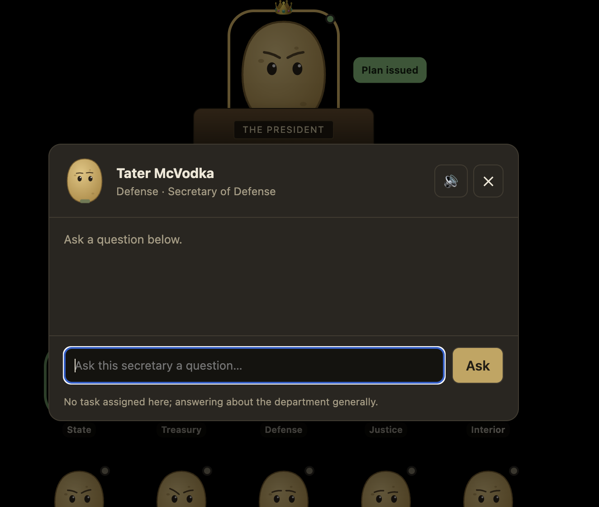
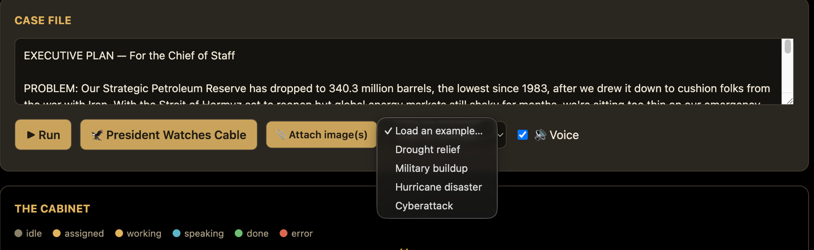

# 🥔 Potato Cabinet

 

## Single file only (runs in your browser)

 

**▶ Live demo: <https://jsherman999.github.io/potato_cabinet/>** (bring your own API keys)

Describe a real-world problem — or let the President pick one from the news — and watch an
LLM "Chief of Staff" route it to the relevant federal departments, coordinate them, and
synthesize a single solution. Each of the 15 cabinet secretaries is its own LLM agent,
rendered as a talking potato — real potato photos with googly eyes and a ventriloquist-dummy
jaw — seated in a ring around the cabinet table. The entire app is one self-contained
`index.html` (no build step, no server, no dependencies); you supply your own API keys.

## Screenshots

## How it works

- **Chief of Staff (orchestrator)** decomposes the problem into JSON assignments, dispatches
  to the relevant secretaries in parallel, runs an optional coordination round, and
  synthesizes the final solution.
- **15 cabinet secretaries** — each an LLM agent grounded in its department's remit.
- **President (optional)** — reviews current news, picks a solvable problem, writes an
  Executive Plan, and hands it to the Chief of Staff.
- **The cabinet table** — the secretaries sit in a circle; the latest statement takes the floor
  in the middle of the table, then drops down into the transcript below (newest first).
- **Voice** — each potato speaks (OpenAI neural TTS); its jaw drops open in time with the
  actual audio loudness (browser-speech fallback just flaps).
- **Potato looks** — pick *Photo — mixed / Yukon gold / red / sweet* or the original
  *Cartoon* drawing from the selector on the Cabinet card (remembered per browser).
- **Q&A** — click any potato to ask it questions about the active case or its department.
- **Attachments** — paste links (fetched + summarized) or attach images (vision-analyzed)
  to enrich the case file before routing.

## Run it

You only need the one file:

1. Download **`index.html`** (~140 KB including the embedded potato photos — the whole app; no other files required) or use the
   [live demo](https://jsherman999.github.io/potato_cabinet/).
2. Open it in a browser (double-click / `file://` — no server needed).
3. Open **Settings** and paste **one** API key (see [Getting API keys](#getting-api-keys)) — the app detects
   the provider, loads its models, and you pick the model the whole Cabinet runs on. Hit **Test model**.
4. Type a problem (or pick an example / hit **🦅 President Watches Cable**) and **Run**.

### Getting API keys

You need **one** key, from any of these — paste it into the single key field and the app recognizes
which provider it's from (`sk-or-…` OpenRouter, `sk-ant-…` Anthropic, any other `sk-…` OpenAI).

| Provider | Get a key | What it gives you |
|---|---|---|
| **OpenRouter** *(easiest start)* | <https://openrouter.ai/keys> | One key reaches OpenAI, Google, Anthropic & Meta models, and powers **live web research** (`:online`). Sign up, add a few dollars of credit, create a key (`sk-or-v1-…`). |
| **OpenAI** | <https://platform.openai.com/api-keys> | OpenAI models **plus the neural voices** (TTS). Sign in, add billing, create a secret key (`sk-…`). |
| **Anthropic** | <https://console.anthropic.com/settings/keys> | Runs **Claude** (Opus / Sonnet / Haiku) directly. Sign in, add billing, create a key (`sk-ant-…`). |

> Voices need an OpenAI key (otherwise the app uses your browser's built-in speech), and the
> President's *auto-pick from the news* + link-reading use live web search only with an **OpenRouter**
> key; with an OpenAI or Anthropic key those answer from the model's training knowledge instead.

### Are my API keys safe?

Yes. There is **no backend** — the app is a single static HTML file, so there's nowhere for
your key to be sent except the model provider itself. Your key is stored only in
**your own browser** (`localStorage`) and are transmitted over HTTPS **directly** to
OpenRouter / OpenAI / Anthropic — the only network requests the app makes. Nothing goes to
any server of mine (there isn't one). You can read the entire `index.html` (~140 KB, most of it embedded photos) to verify
this yourself, and the **Forget key** button wipes it from your browser at any time.

## Models

Once your key is in, **Settings** lists that provider's models (with a filter box — OpenRouter offers
hundreds). The model you pick runs **every** role: the President, the Chief of Staff, all 15
secretaries, link reading and image analysis. On OpenRouter, the news/link-reading calls add
`:online` to your model for live web search. Until you choose, the default is the first available of
`openai/gpt-4.1-mini` (OpenRouter), `gpt-4.1-mini` (OpenAI) or `claude-sonnet-4-6` (Anthropic) —
see `CONFIG.providers` near the top of `index.html`. Image analysis needs a vision-capable model.

Voice is separate from the model you pick: it uses OpenAI's dedicated `gpt-4o-mini-tts` model when
the key is an OpenAI key (lip-synced), otherwise the browser's built-in speech. If the OpenAI voice
fails (e.g. the project has no access to the TTS model), the app switches to browser speech for the
rest of the session and says why in Settings (and marks the 🔊 Voice box "(browser)");
**Test model & voice** plays a sample and retries the OpenAI voice.

See **[PLAN.md](PLAN.md)** for the full design, model research, and build notes.

## Credits

Potato photos: [Fruits-360 dataset](https://github.com/Horea94/Fruit-Images-Dataset) by Horea Muresan
& Mihai Oltean (MIT License) — cut out of their white backgrounds and embedded in `index.html`.

---
*Built with Claude Code. It's potatoes all the way down.*
